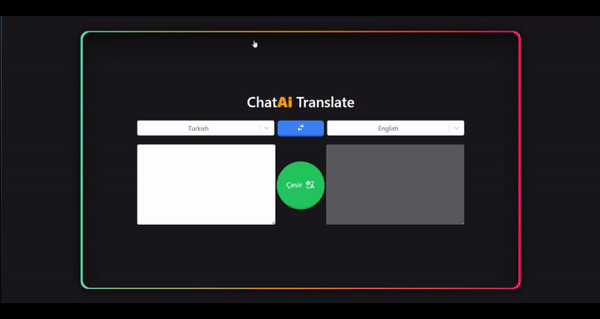

# Çeviri Uygulaması

Bu proje, React kullanarak geliştirilmiş bir çeviri uygulamasıdır. Kullanıcılar, metinleri farklı diller arasında çevirebilir. Proje, çeviri verilerini RapidAPI'den almak için Axios kullanmakta ve kullanıcı arayüzünü Tailwind CSS ile tasarlamaktadır. Durum yönetimi için Redux Toolkit kullanılmıştır.

## Özellikler

- **Çeviri İşlevselliği:** Kullanıcılar, metinleri seçilen diller arasında çevirebilir.
- **Durum Yönetimi:** Redux Toolkit kullanılarak uygulama genelinde etkili bir durum yönetimi sağlanmıştır.
- **API Entegrasyonu:** RapidAPI üzerinden çeviri verileri çekilmektedir.
- **Kullanıcı Dostu Arayüz:** Tailwind CSS ile modern ve duyarlı bir tasarım sunulmuştur.
- **Seçilebilir Diller:** React Select kütüphanesi kullanılarak diller arasında kolayca geçiş yapılabilmektedir.
- **İkonlar:** React Icons kütüphanesi ile kullanıcı arayüzüne çeşitli ikonlar eklenmiştir.

## Ekran Görüntüleri

Proje arayüzünün bir önizlemesini görmek için aşağıdaki GIF'e göz atın:



## Proje Kurulumu

Projeyi yerel ortamınızda çalıştırmak için aşağıdaki adımları izleyin:

1. **Projeyi klonlayın:**

   ```bash
   git clone https://github.com/cengo14/react-redux-translate-app-project.git
   ```

2. **Proje dizinine gidin:**

   ```bash
   cd react-redux-translate-app-project
   ```

3. **Gerekli bağımlılıkları yükleyin:**

   ```bash
   npm install
   ```

4. **API anahtarınızı `.env` dosyasına ekleyin:**

   Proje kök dizininde bir `.env` dosyası oluşturun ve aşağıdaki gibi API anahtarınızı ekleyin:

   ```env
   VITE_API_KEY="your_api_key_here"
   ```

   Kullanıcıların kendi RapidAPI anahtarlarını buraya eklemeleri gerekmektedir.

5. **Uygulamayı başlatın:**

   ```bash
   npm run dev
   ```

6. Tarayıcıda `http://localhost:(ilgili adres)` adresine giderek uygulamayı görüntüleyin.

## Kullanılan Teknolojiler

- **React:** Kullanıcı arayüzü geliştirmek için.
- **Redux Toolkit:** Durum yönetimi için.
- **Axios:** API istekleri yapmak için.
- **Tailwind CSS:** Stil düzenlemeleri için modern bir CSS framework.
- **React Select:** Diller arasında seçim yapmak için.
- **React Icons:** Kullanıcı arayüzünde ikonlar eklemek için.
- **RapidAPI:** Çeviri verileri sağlamak için.
- **Vite:** Hızlı geliştirme ve yapılandırma için kullanılan bir araç.

## Proje Yapısı

```
translate-app/
├── public/
│   └── ...
├── src/
│   ├── components/      # React bileşenleri
│   ├── redux/        # Redux Toolkit özellikleri
│   ├── utils/        # Yardımcı dosyalar
│   ├── App.jsx           # Ana bileşen
│   ├── main.jsx           # Giriş noktası
│   ├── index.css         # Stil dosyaları
│   └── ...
├── .env                 # Çevresel değişkenler
├── package.json         # Proje bağımlılıkları
├── index.html
└── README.md            # Proje belgeleri
```


## Katkıda Bulunma

Katkıda bulunmak isterseniz, aşağıdaki adımları takip ederek projeye katkıda bulunabilirsiniz:

1. Projeyi fork edin.
2. Yeni bir feature branch oluşturun (`git checkout -b feature/YourFeature`).
3. Değişikliklerinizi yapın ve commit edin (`git commit -m 'Add some feature'`).
4. Branch'i push edin (`git push origin feature/YourFeature`).
5. Pull request oluşturun.

## Lisans

Bu proje MIT lisansı ile lisanslanmıştır. Ayrıntılar için `LICENSE` dosyasına bakın.

